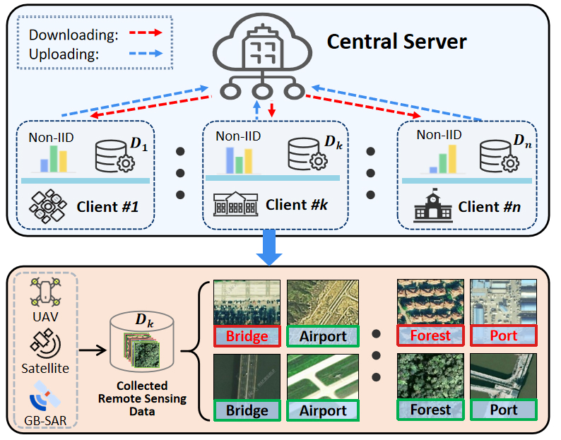

# FedROM
**Federated Representation Optimal Matching for Robust Federated Learning with Noisy Labels in Remote Sensing**

<div align="center">



[](https://www.python.org/downloads/)
[](https://pytorch.org/)
[](LICENSE)

</div>

## Abstract

This repository contains the implementation of our paper "Representation Optimal Matching for Robust Federated Learning with Noisy Labels in Remote Sensing". We introduce FedROM, a novel federated learning framework that addresses label noise in distributed remote sensing tasks without requiring auxiliary data or transmitting extra sensitive information. The full paper (early access) is available [here](https://ieeexplore.ieee.org/document/11318964).

## Installation

### Key Requirements
- Python 3.8+
- PyTorch 1.11.0

### Install Dependencies
```bash
pip install -r requirements.txt
```

## Dataset Preparation

Please download the dataset from [this link](https://fedrs-bench.github.io/). The dataset file structure should be:

```
./dataset
├── FedRS
│   ├── NIID-1
│   ├── NIID-2
│   ├── val_balanced
│   └── val_imbalanced
├── FedRS-5
│   ├── NIID-1
│   ├── NIID-2
│   ├── val_balanced
│   └── val_imbalanced
└── FedRS.7z (extract this .7z file to get all datasets)
```

## Usage

### Basic Usage
```bash
python FL_train.py --alg fedrom --model resnet18 --dataset RS-5 --noise_rate 0.8 --noise_pattern symmetric
```

### Key Parameters
- `--alg`: Federated learning algorithm (fedrom, fedavg, fedprox, etc.)
- `--model`: Model architecture (resnet18, alexnet, etc.)
- `--dataset`: Dataset (RS-5, RS-15)
- `--noise_rate`: Label noise rate (0.0-1.0)
- `--noise_pattern`: Noise pattern (symmetric, asymmetric)

For more configuration options, see `args.py`.

## Project Structure

```
ROT/
├── algorithms/          # Federated learning algorithms
│   ├── fedrom.py       # FedROM core algorithm
│   ├── fedavg.py       # FedAvg algorithm
│   └── ...
├── utils/              # Utility functions
│   ├── model.py        # Model definitions
│   ├── datasets.py     # Dataset processing
│   └── utils.py        # General utilities
├── FL_train.py         # Main training script
├── args.py             # Parameter configuration
└── requirements.txt    # Dependencies
```

## Results

FedROM demonstrates robust performance across 18 baseline methods on two real-world remote sensing datasets with varying label noise rates and multi-source domains.

## Citation

If you use this code in your research, please cite our paper:

```bibtex
@article{fedrom,
  author    = {Xuefeng Jiang and
               Tian Wen and
               Sheng Sun and
               Jinliang Yuan and
               Huashuo Liu and
               Peng Li and
               Lihua Wu and
               Yuwei Wang and
               Min Liu},
  title     = {Representation Optimal Matching for Federated Learning with Noisy Labels
               in Remote Sensing},
  journal   = {{IEEE} Transactions on Mobile Computing},
  year      = {2025},
  doi       = {10.1109/TMC.2025.3649179}
}
```

## License

This project is licensed under the MIT License - see the [LICENSE](LICENSE) file for details.

## Acknowledgments

We sincerely appreciate the authors of the FedRS datasets. More information can be found at [FedRS](https://fedrs-bench.github.io/).


<div align="center">
<strong>⭐ If this project helps you, please give us a star! ⭐</strong>
</div>
