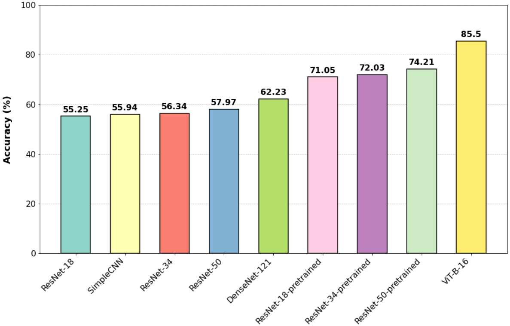

# ROT

## Abstract
Codes for our manuscript "Representation Optimal Transport for Robust Federated Learning with Noisy Labels in Remote Sensing".

## Requirements
```
pip install -r requirements.txt
```

## Dataset Preparation
Please load the dataset via [this link](https://fedrs-bench.github.io/). The dataset related file tree should be like this:
```
./dataset
├── FedRS
│   ├── NIID-1
│   ├── NIID-2
│   ├── val_balanced
│   └── val_imbalanced
├── FedRS-5
│   ├── NIID-1
│   ├── NIID-2
│   ├── val_balanced
│   └── val_imbalanced
└── FedRS.7z (we load this .7z file to extract all datasets)
```

## Usage
```
python FL_train.py --alg fedrot-local --model resnet18 --dataset RS-5 --noise_rate 0.8 --noise_pattern symmetric
```
More settings can be found in  `args.py`.

## Scalability on Diverse Model Architectures



## Acknowledgments
We sincerely appreciate the authors of the FedRS datasets, and more information can be found in the [FedRS](https://fedrs-bench.github.io/).